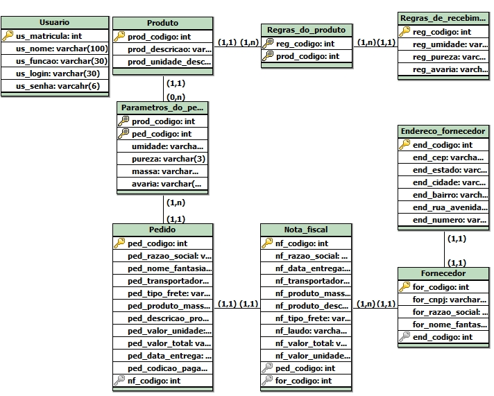
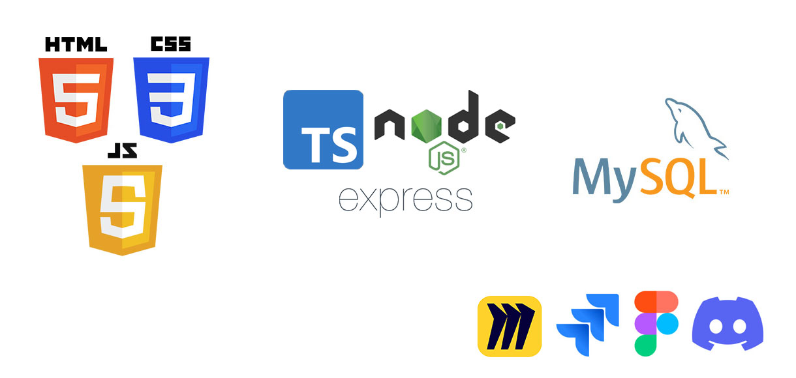

<h1 align="center">FATEC Prof Jessen Vidal, São José dos Campos - 2º Semestre DSM 2023</h1>

    <a href="#sobre">Sobre</a> | 
    <a href="#instalacao">Instalação</a> |
    <a href="#entregas">Entregas</a> | 
    <a href="#backlogs">Backlogs</a> |
    <a href="#burndown">Burndown</a> |
    <a href="#modeloLogico">Modelo Lógico</a> |
    <a href="#tecnologias">Tecnologias</a> | 
    <a href="#equipe">Equipe</a> | 

<h2> Sobre o projeto </h2> 
Projeto desenvolvido por alunos do 2º semestre do curso de Desenvolviento de Software Multiplatafora, da FATEC Prof Jessen Vidal em São José dos Campos.   Consiste no Desenvolvimento de um sistema de inspeção de entrada pra controle de recebimento de grãos em uma agroindústria. 
O Back-end foi desenvolvido em TypeScript utilizando o framework express e o banco de dados foi o SQL com o SGBD MySQL. 
>Status do projeto: Em desenvolvimento :hourglass:

<h2> Executar a aplicação </h2>
<ul>
	<li>Tenha o Node.js e o MySQL instalados</li>
	<li>Clone o repositório</li>
	<li>Acesse o projeto pelo terminal</li>
	<li>Instale as dependências do projeto</li>
        <code>npm installl</code>  
	<li>Utilize dos arquivos script .sql no diretório bd para criar a estrutura do banco de dados</li>
	<a href="https://www.youtube.com/watch?v=Y18wK0v6mxA">Tutorial em mais detalhes para importar scripts no MySQL</a>  
	<li>Configure as informações da conexão de acordo com o seu servidor no arquivo 'bancoDados.ts'</li> 
        <pre>this.conexao = await mysql.createConnection({ 
                host: 'localhost', 
                user: '', //Nome do usuário, 'root' por padrão 
                password: '', //sua senha 
                database: 'api', //base de dados do api 
                port: 3306 
}</pre>  
	<li>Compile o código</li>
        <code>npx tsc</code>  
	<li>Execute a aplicação no código compilado</li> 
        <pre>cd out //pasta que os arquivos foram compilados
         node app.js
         //o link para acessar aparecerá no terminal
        </pre>
</ul>

<h2>Entregas</h2>
O projeto está sendo realizado utilizando-se da metodologia ágil SCRUM, separadas em 4 entregas com sprints de 21 dias de duração cada uma.  

| Sprint| Período | Status |
|:-----:|:----------:|:---------:|
| 01 |   13/03/2023 - 02/04/2023 | Entregue :hourglass: | 
| 02 |   03/04/2023 - 23/04/2023 | Pendente :hourglass: |  
| 03 |   24/04/2023 - 14/05/2023 | Pendente :hourglass: | 
| 04 |   15/05/2023 - 04/06/2023 | Pendente :hourglass: | 

<h2>Backlogs</h2>
<h3>Backlog do Produto</h3>

| Sprint | Funcionalidade | User Story | Critérios de Aceitação | 
| :--:   | :-----------:  | :--: | :--: |
| **01** | Cadastro de pedido. | **01** | **01** |
| **01** | Cadastro de fornecedor. | **02** | **02** |
| **01** | Listagem de pedidos cadastrados. | **03** | **03** |
| **01** | Listagem de fornecedores cadastrados. | **04** | **04** |
| **02** | Cadastro de produto. | **05** | **05** |
| **02** | Cadastro de regras de recebimento. | **06** | **06** |
| **02** | Cadastro de usuário. | **07** | **07** |
| **02** | Deve haver diferentes níveis de acesso (usuário comum, gerente e administrador). | **08** | **08** |
| **02** | Listagem de usuários cadastrados. | **09** | **09** |
| **02** | Listagem de produtos cadastrados. | **10** | **10** |
| **03** | Na fase de entrada do matérial, deve haver a inserção dos dados da nota fiscal. | **11** | **11** |
| **03** | Na fase de conferência quantitativa, deve haver a inserção da quantidade do material em análise | **12** | **12** |
| **03** | Filtragem da lista de pedidos por etapa do processo | **13** | **13** |
| **03** | Deverá ser possível voltar em fases anteriores do processo de entrada de material | **14** | **14** |
| **03** | Na fase de conferência qualitativa, o usuário deverá ter acesso há uma tela que o permite informar se há avarias, se o laudo veio anexado à nota fiscal e as informações relacionadas às regras de recebimento. | **15** | **15** |
| **04** | O Sistema deve gerar um relatório final com a decisão de aceite ou recusa (feita pelo próprio sistema a partir das regras de négocio e da comparação dos dados inseridos). | **16** | **16** |
| **04** | Sistema deve guardar inforamções de entregas armazenadas (etregas que foram aceitas pelo administrador), bem como mostrar o que há no armazem. | **17** | **17** |
| **04** | Alteração de dados de fornecedores cadastrados. | **18** | **18** |
| **04** | Alteração de dados de usuários cadastrados. | **19** | **19** |
| **04** | Alteração de dados do produtos cadastrados. | **20** | **20** |

<h3>Referência das User Stories</h3>

| ID | User Story |
| :--:   | :----------------:  |
| **01** | Eu como gerente desejo cadastrar os dados do relatório de compras no sistema, para armazenar e gerenciar os pedidos. |
| **02** | Eu como gerente desejo cadastrar os dados do fornecedor, para manter a integridade dessas informações.  |
| **03** | Eu como gerente desejo ver os pedidos já cadastrados, para conferir a conformidade dessas informações. |
| **04** | Eu como gerente desejo ver os fornecedores já cadastrados, para conferir a conformidade dessas informações. |
| **05** | Eu como gerente quero cadastrar produtos, para manter a integridade dos dados relacionados ao conteúdo dos pedidos. |
| **06** | Eu como gerente quero cadastrar as regras de recebimento, para que elas se adequem a diferentes produtos e situações. |
| **07** | Eu como administrador quero cadastrar os trabalhadores, para permitir a eles o acesso ao sistema. |
| **08** | Eu como administrador quero que o sistema tenha níveis de acesso, para que os demais usuários não tenham acesso a funcionalidades críticas e dados sensíveis. |
| **09** | Eu como administrador quero que o sistema liste os usuários cadastrados, para gerencia-los. |
| **10** | Eu como gerente quero que o sistema liste os produtos cadastrados, para ter acesso a suas informações.|
| **11** | Eu como usuário comum desejo marcar o pedido como recebido e inserir os dados da nota fiscal para armazenar os dados da nota e prosseguir o processo de entrada de material. |
| **12** | Eu como usuário comum desejo inserir os dados referentes à análise quantitativa no sistema, para que posteriormente esses dados sejam comparados com os demais documentos pelo sistema. |
| **13** | Eu como usuário comum desejo que o sistema filtre os pedidos de acordo com a etapa em que estão, para que haja uma melhor organização do trabalho. |
| **14** | Eu como usuário comum desejo que o sistema permita a correção de possíveis erros em etapas anteriores do processo, para minimizar o impacto dessas falhas. |
| **15** | Eu como usuário comum quero informar os dados relacionados às análises qualitativas, para que o sistema compare essas informações com as regras de recebimento. |
| **16** | Eu como gerente quero ter acesso ao relatório final e à decisão do sistema de aceite ou recusa do material, para conferir quais foram as inconsistensias do pedido e se será necessário forçar o aceite. |
| **17** | Eu como gerente quero ter acesso aos dados dos produtos já recebidos, para verificar se a decisão se adequa com a realidade da empresa. |
| **18** | Eu como gerente quero poder mudar os dados dos fornecedores, para atualizar informações obsoletas e corrigir possíveis erros cadastrais. |
| **19** | Eu como administrador quero poder mudar os dados dos usuários, para atualizar informações obsoletas e gerenciar as contas. |
| **20** | Eu como gerente quero poder mudar os dados dos produtos, para atualizar informações obsoletas e gerenciar os produtos. |

<h3>Referência dos Critérios de Aceitação</h3>

| ID | Critérios de Aceitação |
| :--:   | :----------------:  |
| **01** | - Deve haver uma página com um formulário de cadastro com estilização. - Tudo o que é inserido nesse formulário deverá ser guardado em um banco no banco de dados. |
| **02** | - Deve haver uma página com um formulário de cadastro de fornecedor com estilização. - Tudo o que é inserido nesse formulário deverá ser guardado em um banco no banco de dados. |
| **03** | - Deve haver uma página home que liste todos os fornecedores com estilização. |
| **04** | - Deve haver uma página que liste todos os fornecedores cadastrados com estilização. - Cada um dos pedidos listados deem levar à fase em que estão no processo ao serem clicados. |
| **05** | - Deve haver uma página com um formulário de cadastro de produto com estilização. - Nessa página deverá ter um campo destinado a adição de regras de recebimento. - Tudo o que é inserido nesse formulário deverá ser guardado em um banco no banco de dados. |
| **06** | - Essa funcionalidade deve estarem um campo página de cadastro de produto. - Nesse campo o usuário deve ser capaz de adicionar regras de nedócio, escolhendo o tipo de regra, a limitação que ela impõem e se seu cumprimento é obrigatório ou não. - Essas informações devem ser guardadas no banco de dados. |
| **07** | - Deve haver uma página estilizada onde é possível cadastrar os usuários. - Apenas o administrador deve ter acesso à essa funcionalidade. - Todas dados cadastradas devem ser guardadas no banco de dados. |
| **08** | - Deve haver o nível de acesso de administrador, que tem acesso a todas as funcionalidades (principalmente as relacionadas ao cadastro e o gerenciamento de usuário). - deve haver o nível de acesso de gerente, que além de fazer o processo de entrada, pode cadastrar produtos, pedidos e fornecedores. - Deve haver o nível de acesso de usuário comum que apenas pode acessar a lista de pedidos, as etapas de conferencia e regularização. |
| **09** | - Deve haver uma página que liste todos os usuários cadastrados com estilização. - Apenas os administradores devem ter acesso a essa funcionalidade. |
| **10** | - Deve haver uma página que liste todos os produtos cadastrados e suas respectivas regras de negócio com estilização. |
| **11** | - Deve haver uma tela de inserção de dados da nota fiscal. - Um botão de computar a informação e continuar o processo, outro de computar e voltar para home, e um botão de cancelar. - As informações devem ser guardadas no banco. - O atributo de fase do pedido deve ser alterado para a próxima fase no banco de dados, caso seja necessário. |
| **12** | - Deve haver uma tela onde o usuário insira os dados da conferencia quantitativa. - Um botão de computar a informação e continuar o processo, outro de computar e voltar para home, e um botão de cancelar. |
| **13** | - Na tela home, deve haver um filtro na tela home (Listagem de Pedidos). Esse filtro deve estar dividido entre pedidos "a caminho", "em análise" e  "finalizados". - Pedidos "a caminho" serão aqueles que ainda não chegaram. Os "em análise" são aqueles que estão na etapa de conferencia qualitativa ou quantitativa. Os finalizados são os pedidos recuzados e aceitos. |
| **14** | - Pedidos listados na home devem se expandiar quando clicados, mostrando mais informações e botões que levem a fazes anteriores, bem como à fase atual. |
| **15** | - Deve haver uma página com as regras de negócio atreladas ao produto em análise com campos para que o usuário insira os dados da análise. - Obrigatóriamente deve haver um campo referente à presença do laudo e outro referente à possíveis avarias. - Essas informações inseridas pelo usuário devem ser guardadas no banco de dados. - Um botão de computar a informação e continuar o processo, outro de computar e voltar para home, e um botão de cancelar. |
| **16** | - Deve haver uma página que gere um relatório que mostre o resultado das comparações feitas entre os dados colocados nas diversas fases. - Nessa página deve haver a decisão que o sistema tomou com base nessas comparações e nas regras de recebimento. - Deve haver um botão de forçar o aceite da entregue, disponível apenas para o administrador e  o gerente. |
| **17** | - Deve haver uma listagem dos pedidos aceitos anteriormente. |
| **18** | - Deve haver uma tela que possibilite a mudança dos dados já cadastrados dos fornecedores. - Apenas o gerente e o administrador devem ter acesso a essa funcionalidade. - Essa tela deve ser acessada ao clicar em um dos fornecedores da tela de listagem de fornecedores. |
| **19** | - Deve haver uma tela que possibilite a mudança dos dados já cadastrados dos usuários. - Apenas o administrador deve ter acesso a essa funcionalidade. - Essa tela deve ser acessada ao clicar em um dos usuários da tela de listagem de usuários. |
| **20** | - Deve haver uma tela que possibilite a mudança dos dados já cadastrados dos produtos e suas respectivas regras de recebimento. - Apenas o gerente e o administrador devem ter acesso a essa funcionalidade. - Essa tela deve ser acessada ao clicar em um dos produtos da tela de listagem de produtos. |

<h3>Backlog das sprints</h3>
<h4>Sprint 1</h4>

| Item | Funcionalidade |
| :--:   | :----------------  |
| **01** | Protótipo navegável. |
| **02** | Cadastro de pedido. |
| **03** | Cadastro de fornecedor. |
| **04** | Listagem de fornecedores cadastrados. |
| **05** | Listagem de pedidos cadastrados. |

<h4>Sprint 2</h4>

| Item | Funcionalidade |
| :--:   | :----------------   |
| **01** | Cadastro de produto. |
| **02** | Cadastro de regras de recebimento. |
| **04** | Cadastro de usuário. |
| **05** | Deve haver diferentes níveis de acesso (usuário comum e usuário administrador). |
| **06** | Listagem de produtos cadastrados. |
| **07** | Listagem de usuários cadastrados. |

<h4>Sprint 3</h4>

| Item | Funcionalidade |
| :--:   | :---------------- |
| **01** | Inserção dos dados da nota fiscal. |
| **02** | Inserção da quantidade de material na fase da análise quantitativa. |
| **03** | Filtragem da lista de pedidos por etapa do processo. |
| **04** | Retornar em fases anteriores do processo de recebimento. |
| **05** | Inserção de dados sobre avaria, regras de recebimento e se o laudo foi entregue junto com a nota fiscal na fase de análise qualitativa. |

<h4>Sprint 4</h4>

| Item | Funcionalidade |
| :--:   | :---------------- |
| **01** | Criação de um relatório final com a decisão de aceite ou recusa do pedido (feito pelo próprio sistema a partir das regras de négocio). |
| **02** | Guardar informações de entregas armazenadas (etregas que foram aceitas), bem como mostrar o que há no armazem. |
| **03** | Alteração de dados de fornecedor cadastrado. |
| **04** | Alteração de dados de usuário cadastrados. |
| **05** | Alteração de dados de produto cadastrados. |

<h2> Modelo Lógico </h2>
Esse projeto foi feito utilizando o Banco de Dados relacional SQL e como ferramenta de gerenciamento o MySQL.  

    

<h2> Tecnologias utilizadas </h2>

<h2> Equipe </h2>

|    Função     | Nome                                |                     GitHub                   |
| :----------:  | :-----------------------            | :------------------------------------------: |
|   Product Owner    | Bruno Denardo                  | [GitHub](https://github.com/brunodenardo)    |
|   Scrum Master   | Matheus Fernando Vieira de Melo  | [GitHub](https://github.com/Matheusfvm)      |
| Dev Team | Renan Souza Neves                        | [Github](https://github.com/Renan-Neves)     |
| Dev Team  | Vinicius de Oliveira Laranjeiro         | [GitHub](https://github.com/noo-e)           |
|   Dev Team    | Murilo Henrique Sangi da Silva Lima | [GitHub](https://github.com/MuriloLima03)    |
| Dev Team | Augusto Henrique Buin                    | [GitHub](https://github.com/AugustoBuin)     |
| Dev Team | Pedro Henrique Silva Almeida             | [GitHub](https://github.com/PedroHSdeAlmeida) |
