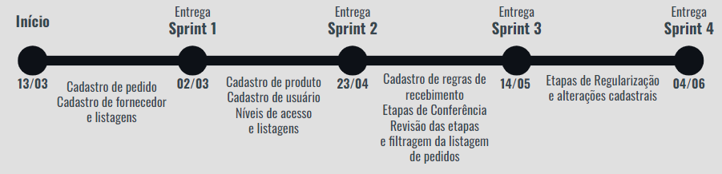
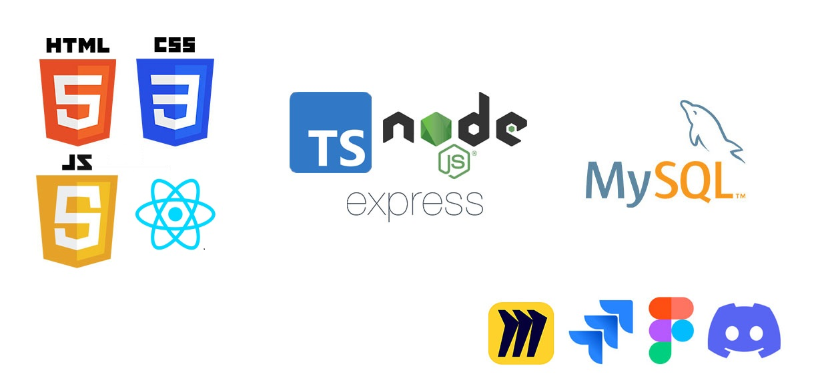

<h1 align="center">FATEC Prof Jessen Vidal, São José dos Campos - 2º Semestre DSM 2023</h1>

    <a href="#sobre">Sobre</a> | 
    <a href="#entregas">Entregas</a> | 
    <a href="#backlogs">Backlogs</a> |
    <a href="#dorDod">DoR e DoD</a>|
    <a href="#tecnologias">Tecnologias</a> | 
    <a href="#equipe">Equipe</a> | 

<h2> Sobre o projeto </h2> 
Projeto desenvolvido por alunos do 2º semestre do curso de Desenvolviento de Software Multiplatafora, da FATEC Prof Jessen Vidal em São José dos Campos.   Consiste no Desenvolvimento de um sistema de inspeção de entrada pra controle de recebimento de grãos em uma agroindústria. 
O Back-end foi desenvolvido em TypeScript utilizando o framework express e o banco de dados foi o SQL com o SGBD MySQL. 
>Status do projeto: Em desenvolvimento :hourglass:

<h2>Entregas</h2>
O projeto está sendo realizado utilizando-se da metodologia ágil SCRUM, separadas em 4 entregas com sprints de 21 dias de duração cada uma.
  

<h2>Backlogs</h2>
<h3>Backlog do Produto</h3>

| Sprint | Funcionalidade | User Story |
| :--:   | :-----------:  | :--: |
| **01** | Cadastro de pedido | **01** | 
| **01** | Cadastro de fornecedor | **02** | 
| **01** | Listagem de pedidos cadastrados | **03** | 
| **01** | Listagem de fornecedores cadastrados | **04** | 
| **02** | Cadastro de produto | **05** | 
| **02** | Cadastro de usuário | **06** | 
| **02** | Deve haver diferentes níveis de acesso (usuário comum, gerente e administrador) | **07** | 
| **02** | Listagem de usuários cadastrados | **08** | 
| **02** | Listagem de produtos cadastrados | **09** | 
| **03** | Cadastro de regras de recebimento | **10** | 
| **03** | Na fase de entrada do matérial, deve haver a inserção dos dados da nota fiscal | **11** | 
| **03** | Na fase de conferência quantitativa, deve haver a inserção da quantidade do material em análise | **12** |
| **03** | Filtragem da lista de pedidos por etapa do processo | **13** |
| **03** | Sistema de buscas para as páginas de listagem | **14** |  
| **03** | Deverá ser possível voltar em fases anteriores do processo de entrada de material | **15** |
| **03** | Na fase de conferência qualitativa, o usuário deverá ter acesso há uma tela que o permite informar se há avarias, se o laudo veio anexado à nota fiscal e as informações relacionadas às regras de recebimento | **16** |
| **04** | O Sistema deve gerar um relatório final com a decisão de aceite ou recusa (feita pelo próprio sistema a partir das regras de négocio e da comparação dos dados inseridos). | **17** |
| **04** | Sistema deve guardar inforamções de entregas armazenadas (etregas que foram aceitas pelo administrador), bem como mostrar o que há no armazem | **18** |
| **04** | Alteração de dados de fornecedores cadastrados | **19** |
| **04** | Alteração de dados de usuários cadastrados | **20** |
| **04** | Alteração de dados do produtos cadastrados | **21** |

<h3>Referência das User Stories</h3>

| ID | User Story |
| :--:   | :----------------:  |
| **01** | Eu como gerente desejo cadastrar os dados do relatório de compras no sistema, para armazenar e gerenciar os pedidos |
| **02** | Eu como gerente desejo cadastrar os dados do fornecedor, para manter a integridade dessas informações  |
| **03** | Eu como gerente desejo ver os pedidos já cadastrados, para conferir a conformidade dessas informações |
| **04** | Eu como gerente desejo ver os fornecedores já cadastrados, para conferir a conformidade dessas informações |
| **05** | Eu como gerente quero cadastrar produtos, para manter a integridade dos dados relacionados ao conteúdo dos pedidos |
| **06** | Eu como administrador quero cadastrar os trabalhadores, para permitir a eles o acesso ao sistema |
| **07** | Eu como administrador quero que o sistema tenha níveis de acesso, para que os demais usuários não tenham acesso a funcionalidades críticas e dados sensíveis |
| **08** | Eu como administrador quero que o sistema liste os usuários cadastrados, para gerencia-los |
| **09** | Eu como gerente quero que o sistema liste os produtos cadastrados, para ter acesso a suas informações |
| **10** | Eu como gerente quero cadastrar as regras de recebimento, para que elas se adequem a diferentes produtos e situações |
| **11** | Eu como usuário comum desejo marcar o pedido como recebido e inserir os dados da nota fiscal para armazenar os dados da nota e prosseguir o processo de entrada de material |
| **12** | Eu como usuário comum desejo inserir os dados referentes à análise quantitativa no sistema, para que posteriormente esses dados sejam comparados com os demais documentos pelo sistema | 
| **13** | Eu como usuário comum desejo que o sistema filtre os pedidos de acordo com a etapa em que estão, para que haja uma melhor organização do trabalho |
| **14** | Eu como gerente desejo que o sistema permita buscas nas páginas de listagem, para que se torne mais fácil encontrar o elemento cadastrado |
| **15** | Eu como usuário comum desejo que o sistema permita a correção de possíveis erros em etapas anteriores do processo, para minimizar o impacto dessas falhas |
| **16** | Eu como usuário comum quero informar os dados relacionados às análises qualitativas, para que o sistema compare essas informações com as regras de recebimento |
| **17** | Eu como gerente quero ter acesso ao relatório final e à decisão do sistema de aceite ou recusa do material, para conferir quais foram as inconsistensias do pedido e se será necessário forçar o aceite |
| **18** | Eu como gerente quero ter acesso aos dados dos produtos já recebidos, para verificar se a decisão se adequa com a realidade da empresa |
| **19** | Eu como gerente quero poder mudar os dados dos fornecedores, para atualizar informações obsoletas e corrigir possíveis erros cadastrais |
| **20** | Eu como administrador quero poder mudar os dados dos usuários, para atualizar informações obsoletas e gerenciar as contas |
| **21** | Eu como gerente quero poder mudar os dados dos produtos, para atualizar informações obsoletas e gerenciar os produtos |

<h3>Sprint 1</h3>

| Item | Funcionalidade |
| :--:   | :----------------  |
| **01** | Protótipo navegável |
| **02** | Cadastro de pedido |
| **03** | Cadastro de fornecedor |
| **04** | Listagem de fornecedores cadastrados |
| **05** | Listagem de pedidos cadastrados |

<h4>Entrega</h4>

<h3>Sprint 2</h3>

| Item | Funcionalidade |
| :--:   | :----------------   |
| **01** | Cadastro de produto | 
| **02** | Cadastro de usuário |
| **03** | Deve haver diferentes níveis de acesso (usuário comum e usuário administrador) |
| **04** | Listagem de produtos cadastrados |
| **05** | Listagem de usuários cadastrados |

<h4>Entrega</h4>

<h3>Sprint 3</h3>

| Item | Funcionalidade |
| :--:   | :---------------- |
| **01** | Cadastro de regras de recebimento |
| **02** | Inserção dos dados da nota fiscal |
| **03** | Inserção da quantidade de material na fase da análise quantitativa |
| **04** | Filtragem da lista de pedidos por etapa do processo |
| **05** | Retornar em fases anteriores do processo de recebimento |
| **06** | Sistema de buscas para as páginas de listagem |
| **07** | Inserção de dados sobre avaria, regras de recebimento e se o laudo foi entregue junto com a nota fiscal na fase de análise qualitativa |

<h3>Sprint 4</h3>

| Item | Funcionalidade |
| :--:   | :---------------- |
| **01** | Criação de um relatório final com a decisão de aceite ou recusa do pedido (feito pelo próprio sistema a partir das regras de négocio) |
| **02** | Guardar informações de entregas armazenadas (etregas que foram aceitas), bem como mostrar o que há no armazem |
| **03** | Alteração de dados de fornecedor cadastrado |
| **04** | Alteração de dados de usuário cadastrados |
| **05** | Alteração de dados de produto cadastrados |

<h2>Definition of Ready e Definition of Done</h2>
Todos os documentos desses artefatos são encontrados na pasta docs do repositório

Os artefatos usados pelo nossa equipe para identificar que uma tarefa está pronta para ser iniciado (DoR) foram:
* <a href="#backlogs">BackLog do Produto:</a> 
Lista com os requisitos do projeto priorizados, que nos auxiliam a chegar a um MVP (Mínimo Produto Viável) na sprint.
* <a href="docs/modelo_logico.jpg">Modelo Lógico do banco de dados:</a> 
Modelo com as tabelas, colunas e os tipos de dados que serve como base para a construção física do banco de dados.
* <a href="docs/casosTeste/">Casos de Teste:</a> 
Modelo com os testes que cada requisito precisa cumprir após sua conclusão. Isso nos ajuda a desenvolver o requisito baseado nos testes que ele precisa passar.
* <a href="docs/Sabiá-Mockup.jpg">Mockup:</a> 
Modelo com os esboços das telas da nossa aplicação. Ajudou posteriormente no desenvolvimento do prótotipo.
* <a href="docs/criteriosAceitacao.pdf">Critérios de Aceitação:</a> 
Lista de itens que exemplificam o funcionamento dos requisitos baseados nas suas User Stories.

Baseado nos DoR chegamos a esses critérios para considerar um requisito como entregue, podendo ser incrementado a entrega do projeto (DoD):
* <a href="backEnd/bd">O modelo físico:</a> 
Modelo físico do banco de dados seguindo o padrão do modelo lógico.
* <a href="https://www.figma.com/proto/1BLzM65qzng5exjhuqab28/SABI%C3%81?node-id=45-100&starting-point-node-id=45%3A100&scaling=contain" target="_blank">Protótipo:</a> 
Telas da aplicação baseada nas telas do protótipo.
* <a href="docs/casosTeste/">Os resultados dos testes de cada funcionalidade:</a> 
Esses resultados devem seguir os resulatados propostos na tabela de casos de teste.

<h2> Tecnologias utilizadas </h2>

<h2> Equipe </h2>

|    Função     | Foto       | Nome                                |                     GitHub                   |
| :----------:  | :-----------: | :-----------------------            | :------------------------------------------: |
|   Product Owner    |  | Bruno Denardo                  | [GitHub](https://github.com/brunodenardo)    |
|   Scrum Master   |  | Matheus Fernando Vieira de Melo  | [GitHub](https://github.com/Matheusfvm)      |
| Dev Team |  | Renan Souza Neves                        | [Github](https://github.com/Renan-Neves)     |
| Dev Team  |  | Vinicius de Oliveira Laranjeiro         | [GitHub](https://github.com/noo-e)           |
|   Dev Team    |  | Murilo Henrique Sangi da Silva Lima | [GitHub](https://github.com/MuriloLima03)    |
| Dev Team |  | Augusto Henrique Buin                    | [GitHub](https://github.com/AugustoBuin)     |
| Dev Team |  | Pedro Henrique Silva Almeida             | [GitHub](https://github.com/PedroHSdeAlmeida) |
